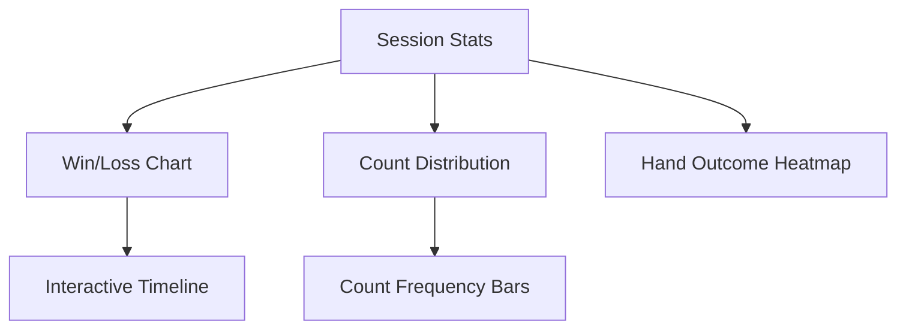

## Comprehensive Enhancement Roadmap

Plans to evolve this project from simulator to a professional-grade training platform.

### 🧠 Core Experience Upgrades

* Skill-based progression (Beginner → Expert)
* Challenge Mode (e.g., win 5 hands with TC > +3)
* Session tracking with money-based stats

### 💰 Bankroll Management

* Virtual \$10,000 starter balance
* Bet slider (1%–100% of bankroll)
* Bet spread engine based on true count thresholds
* Profit/loss tracking with session summaries

### 📘 Advanced Strategy

* Deviation training (Illustrious 18 + Fab 4)
* Illustrated strategy charts
* Side bet simulations
* Tournament mode with AI or friends

### 🎨 UI/UX Enhancements

* Custom table themes (Vegas, Monte Carlo)
* Dealer personalities
* 3D card animations
* Strategy overlay & hover-reference
* Mistake feedback with grading (Perfect, Good, Poor)

### 📊 Analytics

### 📱 Accessibility & Performance

* Web Workers for calc efficiency
* Predictive preloading
* Full keyboard navigation
* Colorblind-friendly suits

### 🌍 Community & Retention

* Leaderboards & challenges
* Shareable hands/scenarios
* Daily practice goals
* Seasonal tournaments

### 💼 Monetization Strategy

* Premium features (AI coaching, detailed hand history, exclusive content)
* Subscription: Monthly training plans, expert Q\&A
* Affiliate: Book/tools recommendations

---

